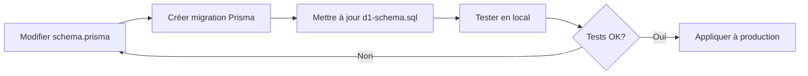

# 🇫🇷 Guide Rapide - Gestion Base D1

## 📝 Résumé

Votre base de données D1 a été **nettoyée et recréée from scratch** avec un schéma propre et correct.

## 🎯 Commandes essentielles

### 1. Réinitialiser la base LOCALE (développement)
```bash
./scripts/reset-d1.sh
```
✅ **Déjà fait et testé !**

### 2. Réinitialiser la base DISTANTE (production Cloudflare)
```bash
./scripts/reset-d1-remote.sh
```
⚠️ **Attention** : Affecte la production, demande confirmation

### 3. Vérifier les tables créées

**Local :**
```bash
wrangler d1 execute miniorg-production --command="SELECT name FROM sqlite_master WHERE type='table' ORDER BY name;"
```

**Remote (Cloudflare) :**
```bash
wrangler d1 execute miniorg-production --remote --command="SELECT name FROM sqlite_master WHERE type='table' ORDER BY name;"
```

## 📦 Tables créées

✅ Toutes les tables avec leur schéma complet :

1. **User** - Utilisateurs de l'application
2. **Account** - Comptes OAuth (Google)
3. **Session** - Sessions utilisateur
4. **VerificationToken** - Tokens de vérification
5. **Task** - Tâches (avec colonne `duration` ✅)
6. **Tag** - Tags pour organiser les tâches
7. **CalendarEvent** - Événements de calendrier
8. **_TaskTags** - Relation many-to-many Task ↔ Tag

## 📂 Fichiers importants

| Fichier | Description |
|---------|-------------|
| `prisma/d1-schema.sql` | 📄 Schéma SQL complet et propre |
| `scripts/reset-d1.sh` | 🔄 Reset base locale |
| `scripts/reset-d1-remote.sh` | 🌍 Reset base distante |
| `scripts/README.md` | 📖 Documentation complète |
| `BASE_D1_PRETE.md` | ✅ Guide de succès |

## 🚦 Workflow recommandé



### Étapes détaillées :

1. **Modifier le schéma** : Éditez `prisma/schema.prisma`
   ```bash
   # Exemple : Ajouter un champ
   ```

2. **Créer une migration Prisma** (pour la base locale SQLite)
   ```bash
   npx prisma migrate dev --name nom_de_la_migration
   ```

3. **Mettre à jour `d1-schema.sql`**
   - Copiez le SQL de la nouvelle migration
   - Mettez à jour le fichier `prisma/d1-schema.sql`

4. **Appliquer à D1 local**
   ```bash
   ./scripts/reset-d1.sh
   ```

5. **Tester l'application**
   ```bash
   npm run dev
   ```

6. **Appliquer à D1 distant** (production)
   ```bash
   ./scripts/reset-d1-remote.sh
   ```

## 🔍 Commandes de débogage

### Voir le schéma d'une table
```bash
wrangler d1 execute miniorg-production --command="PRAGMA table_info(Task);"
```

### Compter les enregistrements
```bash
wrangler d1 execute miniorg-production --command="SELECT COUNT(*) as count FROM User;"
```

### Voir les dernières tâches
```bash
wrangler d1 execute miniorg-production --command="SELECT id, title, status FROM Task ORDER BY createdAt DESC LIMIT 5;"
```

### Voir les index créés
```bash
wrangler d1 execute miniorg-production --command="SELECT name FROM sqlite_master WHERE type='index';"
```

## ⚡ Astuces

### Pour éviter de taper la confirmation
```bash
# Local
echo "oui" | ./scripts/reset-d1.sh

# Remote (production)
echo "PRODUCTION" | ./scripts/reset-d1-remote.sh
```

### Créer un backup avant reset
```bash
# Exporter les données avant de reset
wrangler d1 export miniorg-production > backup-$(date +%Y%m%d-%H%M%S).sql
```

## 🆘 En cas de problème

### "Command not found: wrangler"
```bash
npm install -g wrangler@latest
```

### "Not authenticated"
```bash
wrangler login
```

### "Database not found"
Vérifiez que le `database_id` dans `wrangler.toml` est correct.

### Erreurs de permissions
Utilisez les permissions `all` ou exécutez directement dans le terminal.

---

**Questions ?** Consultez `scripts/README.md` pour plus de détails.
